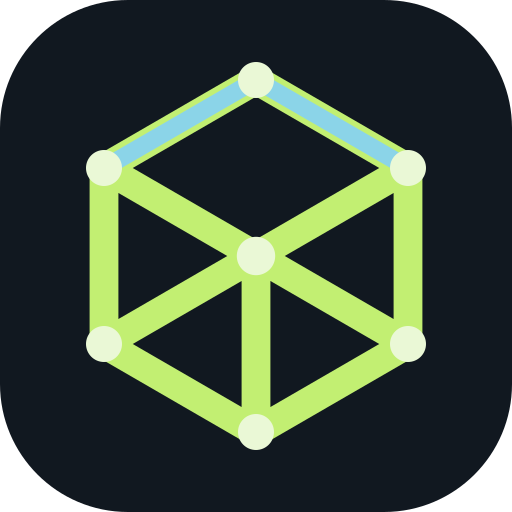
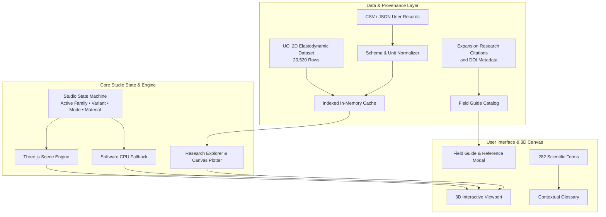

# Matter Lab

<p align="center">
  
</p>

<p align="center">
  <strong>Interactive 3D learning studio for exploring 36 metamaterial families, engineered lattice geometries, physical behaviors, real-world product assemblies, and research datasets.</strong>
</p>

<p align="center">
  
  
  
  
  
  
  
</p>

---

## Overview

**Matter Lab** is a browser-based computational materials studio designed to bridge the gap between abstract metamaterial physics and intuitive, physical understanding. By transforming complex periodic architectures, auxetic mechanisms, and wave-manipulating metamaterials into interactive 3D visualizations, Matter Lab lets students, educators, and engineers explore:

- How cellular geometry dictates macro-scale mechanical, optical, acoustic, thermal, and electromagnetic properties.
- How engineered structures respond to compressive loads, shear forces, sound waves, heat flux, and light.
- How metamaterial cores integrate into actual functional products (from aircraft wings to orthopedic braces and athletic footwear).
- Real-world experimental data across 20,520 specimens from the UCI 2D Elastodynamic Metamaterials research repository.

> [!IMPORTANT]
> **Scientific & Educational Disclaimer:** Matter Lab is an exploratory educational studio. Its procedural 3D models and animated sequences demonstrate structural concepts and qualitative mechanisms. They are not finite-element analysis (FEA), multiphysics simulations, certified design allowables, or manufacturing-ready CAD specifications. Always refer to cited peer-reviewed literature for quantitative experimental data.

---

## Key Highlights

- **36 Curated Metamaterial Families:** Spanning 7 physics domains (Mechanical, Electromagnetic, Optical, Acoustic, Thermal, Magnetic, and Electromechanical).
- **108 Catalog Variants:** 3 distinct topological or geometric configurations for every family (e.g., sheet, skeletal, graded gyroids; re-entrant variations; chiral patterns).
- **Interactive Procedural 3D Engine:** Powered by Three.js with real-time orbit, zoom, pan, cross-sectional cutaways, projected 3D component callouts, and animated kinematics.
- **CPU Software Renderer Fallback:** Built-in geometric rasterizer ensuring full interactive accessibility in environments or browsers where WebGL/GPU acceleration is unavailable.
- **6 Dedicated Product Application Assemblies:** Explore how cellular cores function inside full-scale products:
  - **Gyroid Midsole Running Shoe:** Articulated gait cycle with leg inverse kinematics, ground contact, and cushioning deformation.
  - **Octet-Truss Aircraft Wing:** Internal stiffening core inside a commercial transport wing with aerodynamic banking.
  - **Re-Entrant Auxetic Knee Brace:** Articulating knee sleeve with hinge stays, tension dial, and joint flexion.
  - **Kelvin Cell Impact Helmet:** Contoured headform with dual-density liner subjected to ballistic drop and rebound damping.
  - **Honeycomb Core Skateboard:** Rolling deck with composite face skins, vertical cell walls, trucks, and wheels.
  - **Local Resonator Motor Mount:** Rotating machinery with internal resonant mass damping for vibration suppression.
- **Research Data Explorer (20,520 Rows):** Live dataset search, multi-variable filtering, nearest-neighbor matching, and high-performance HTML5 Canvas scatter plotting using the UCI 2D Elastodynamic Metamaterials corpus.
- **Evidence & Provenance Framework:** Clear epistemic grading (Grade A: peer-reviewed measured; Grade B: verified simulation; Grade C: digitized/derived; Grade D: qualitative illustration).
- **Contextual Scientific Glossary:** 282 indexed terms with deep linking, keyboard shortcuts, and interactive component tooltips.
- **Data Ingestion & Export:** Drag-and-drop CSV/JSON upload with client-side schema validation, unit normalization, and session persistence.

---

## Metamaterial Catalog

### 1. Core Lattice Families (with Complete Product Assemblies)

| Family | Geometric Mechanism | Product Assembly Scene |
| :--- | :--- | :--- |
| **Gyroid** | Triply periodic minimal surface (TPMS) with continuous, smooth stress dispersion | **Athletic Running Shoe:** Midsole compression during continuous footstrike gait |
| **Octet Truss** | Face-centered cubic network of octahedral and tetrahedral struts with exceptional stiffness-to-weight | **Commercial Aircraft:** Internal wing-box spar and skin inspection |
| **Re-entrant** | Auxetic negative Poisson's ratio structure whose ribs expand laterally when subjected to tension | **Articulated Knee Brace:** Conformal joint protection under dynamic flexion |
| **Kelvin Cell** | Space-filling tetrakaidecahedron (14-sided polyhedron) balancing volume and energy absorption | **Protective Helmet:** Multiaxis impact mitigation and ballistic drop settling |
| **Honeycomb** | Hexagonal prismatic cellular array maximizing out-of-plane shear and bending resistance | **Skateboard Deck:** Lightweight structural sandwich panel with composite skins |
| **Local Resonator** | Elastic matrix embedding heavy resonant internal cores for acoustic and vibrational band gaps | **Industrial Drive Mount:** Dynamic vibration attenuation and motor isolation |

### 2. Research-Linked Extended Catalog (30 Families)

| Domain | Metamaterial Families | Primary Physical Phenomena |
| :--- | :--- | :--- |
| **Mechanical** | • Pentamode Lattice<br>• Rotating Squares<br>• Chiral Honeycomb<br>• Miura Origami<br>• Kirigami Ribbon Sheet<br>• Bistable Beam Array<br>• Tensegrity Cell<br>• Spinodal Shell<br>• Chainmail Fabric<br>• Bimetallic Thermal Strip | Uncouples bulk vs. shear modulus; negative Poisson's ratio; chirality-induced torsion; deployable fold geometry; topological out-of-plane buckling; elastic snap-through energy absorption; pre-stressed strut floating equilibrium; bi-continuous bicontinuous decomposition; interlocking load-bearing textiles; differential thermal actuation. |
| **Electromagnetic** | • Negative-Index Split-Ring Array<br>• Epsilon-Near-Zero Channel<br>• Space-Time Modulated Metasurface | Simultaneous negative permittivity ($\varepsilon < 0$) and permeability ($\mu < 0$); infinite phase velocity tunneling; non-reciprocal frequency translation without magnetic bias. |
| **Optical** | • Photonic Bandgap Crystal<br>• Quasi-BIC Metasurface<br>• Phase-Change Metasurface<br>• Liquid-Crystal Tunable Surface<br>• Huygens Metasurface<br>• Structural-Color Pillar Array<br>• Graphene Broadband Absorber | Total optical reflection band gaps; bound states in the continuum with ultra-high Q resonances; sub-wavelength non-volatile optical phase shifting; electro-optic beam steering; reflectionless $2\pi$ wavefront shaping; angle-independent pigmentless color; critical infrared plasmonic coupling. |
| **Acoustic** | • Helmholtz Resonator Array<br>• Acoustic Hologram Plate<br>• Ventilated Metamaterial Silencer<br>• Bubble Metascreen<br>• Acoustic Luneburg Lens | Sub-wavelength acoustic absorption; phase-engineered acoustic levitation and beam manipulation; broadband noise attenuation with open airflow; super-attenuating min-monopole resonance; gradient-index acoustic focusing. |
| **Thermal** | • Thermal Concentrator<br>• Thermal Diode<br>• Selective Thermal Emitter | Transformation-thermodynamics heat flux guiding; asymmetric directional heat conduction; tailored emissivity spectra matching atmospheric transparency windows. |
| **Magnetic** | • Magnetically Programmable Elastomer | Embedded ferromagnetic microparticles enabling contactless, reversible magneto-mechanical shape morphing. |
| **Electromechanical** | • Piezo-Shunted Beam | Adaptive structural damping and tunable elastic wave propagation through resistive-inductive shunted piezo elements. |

---

## Interactive Studio Architecture



### Architectural Principles

1. **Strict Type Separation:**
   - `latticeDefinition`: Parametric topology and geometry generation routines.
   - `reportedObservation`: Peer-reviewed physical measurements with citation DOI, conditions, and evidence grades.
   - `illustrationProfile`: Visual shaders, kinematic motion controllers, and stress/field color gradients.
2. **Deterministic Procedural Modeling:**
   - Procedural geometry functions build unit cells and tiled fields dynamically with configurable strut diameters, aspect ratios, and relative densities.
   - Instanced meshes and shared geometries minimize GPU draw calls and memory overhead.
3. **High-Performance Dataset Queries:**
   - Fast $O(n \cdot 5)$ top-k ranking and scanning across 20,520 rows avoids heavy allocations and sorting overhead, achieving sub-millisecond query execution.
   - Canvas-based batch scatter plotting renders tens of thousands of data points at 60 FPS without DOM bloat.

---

## Project Structure

```text
matter/
├── app/                              # Next.js App Router root
│   ├── globals.css                   # Tailwind CSS v4 styling & dark theme tokens
│   ├── layout.tsx                    # Root HTML metadata, PWA configuration & fonts
│   └── page.tsx                      # Main Studio client entry point
├── components/
│   ├── matter/
│   │   ├── models/                   # Procedural 3D model factories & application scenes
│   │   │   ├── ShoeAssembly.ts       # Running shoe midsole with animated runner
│   │   │   ├── AircraftAssembly.ts   # Octet aircraft wing structure
│   │   │   ├── KneeBraceAssembly.ts  # Auxetic re-entrant knee brace
│   │   │   ├── HelmetAssembly.ts     # Kelvin cell impact helmet & ball drop
│   │   │   ├── SkateboardAssembly.ts # Honeycomb composite board assembly
│   │   │   ├── MotorAssembly.ts      # Vibration-isolated rotating motor
│   │   │   └── *Expansion.ts         # 30 procedural models for research families
│   │   ├── Studio.tsx                # Primary studio view, toolbars & layout state
│   │   ├── Scene.tsx                 # Three.js lifecycle, camera, lights & cutaways
│   │   ├── SoftwareRenderer.ts       # CPU-based polygon rasterizer fallback
│   │   ├── FieldGuide.tsx            # Visual guide with literature links & references
│   │   ├── MiniLattice.tsx           # Lightweight on-demand 3D catalog previews
│   │   ├── ResearchExplorer.tsx      # UCI dataset query interface & filter drawer
│   │   ├── ResearchPlot.tsx          # High-performance 2D canvas scatter plot
│   │   ├── Glossary.tsx              # 282-term interactive scientific glossary
│   │   └── ReuiControls.tsx          # Accessible Radix UI dropdowns & controls
│   └── ui/                           # Base UI component primitives
├── lib/
│   └── matter/
│       ├── catalog.ts                # Master catalog definitions (36 families, 108 variants)
│       ├── expansion.ts              # Extended research catalog specifications
│       ├── geometry.ts               # Parametric unit cell & lattice math
│       ├── glossary.json             # Glossary dictionary & descriptions
│       └── expansion-references.json # Reference image credits & DOI links
├── public/
│   ├── data/
│   │   ├── elastodynamic.json        # 20,520 rows from UCI Metamaterials dataset
│   │   └── research.json             # Bibliographic records & DOI mappings
│   ├── images/                       # Reference photography and micrographs
│   └── fonts/                        # Self-hosted Inter Variable font files
├── docs/
│   ├── ARCHITECTURE.md               # Product requirement & architectural decision record
│   ├── IMPLEMENTATION.md             # Verification log, kinematics tests & roadmap
│   └── licenses/                     # Third-party component & dataset licenses
├── scripts/                          # CI validation & geometry sanity check scripts
├── package.json                      # Project metadata & dependencies
└── vite.config.ts                    # Vite / Vinext build configuration
```

---

## Getting Started

### Prerequisites

- **Node.js**: `v22.13.0` or higher
- **Package Manager**: `npm` (v10+)
- **Browser**: Modern Chromium, Firefox, or Safari (WebGL 2.0 recommended)

### Installation & Local Development

1. **Clone the repository:**
   ```bash
   git clone https://github.com/bede-lau/matter.git
   cd matter
   ```

2. **Install dependencies:**
   ```bash
   npm install
   ```

3. **Start the local development server:**
   ```bash
   npm run dev
   ```

4. **Open your browser:**
   Navigate to the local address displayed in the terminal (typically `http://localhost:5173`).

### Verification & Testing

```bash
# Run model geometry, assembly transforms, and gait kinematic checks
npm run test:models

# Run production build and Node test suite
npm test

# Run ESLint validation
npm run lint
```

> [!NOTE]
> On Windows environments, build scripts utilizing shell execution can be run inside **Git Bash** or **WSL** (Windows Subsystem for Linux).

---

## Data & Citations

- **UCI 2D Elastodynamic Metamaterials Dataset:**
  The dataset located in `public/data/elastodynamic.json` provides 20,520 normalized finite-element elastodynamic band gap and dispersion calculations. Distributed under **Creative Commons Attribution 4.0 International (CC BY 4.0)**.
  - *Source:* [UCI Machine Learning Repository: 2D Elastodynamic Metamaterials](https://archive.ics.uci.edu/dataset/692/2d%2Belastodynamic%2Bmetamaterials)
- **Gyroid Surface Mathematics:**
  Alan H. Schoen, *Infinite Periodic Minimal Surfaces Without Self-Intersections*, NASA Technical Note TN D-5541 (1970).
- **Literature References:**
  Every family in the Field Guide contains direct outbound links to seminal publications across Nature, Science, Advanced Materials, Physical Review Letters, and IEEE journals. See `lib/matter/expansion-references.json` for attribution details.

---

## Technology Stack

- **Framework:** [Next.js](https://nextjs.org/) & [Vinext](https://github.com/cloudflare/vinext) / [Vite](https://vitejs.dev/)
- **Language:** [TypeScript](https://www.typescriptlang.org/) (Strict mode)
- **3D Graphics:** [Three.js](https://threejs.org/)
- **UI Primitives:** [Radix UI](https://www.radix-ui.com/) & [Base UI](https://base-ui.com/)
- **Styling:** [Tailwind CSS v4](https://tailwindcss.com/)
- **Icons:** [Lucide React](https://lucide.dev/)
- **Data & Charts:** HTML5 Canvas custom high-speed batch renderer & [Recharts](https://recharts.org/)

---

## License

This project is licensed under the terms described in the repository's license files. Research datasets retain their respective original licenses (e.g., CC BY 4.0 for UCI Elastodynamic Metamaterials). Images and figures linked in the Field Guide belong to their respective publishers and authors; check individual entry metadata before reuse.
