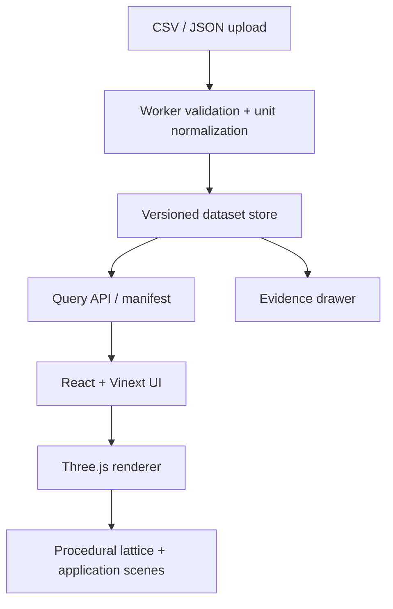

# Metamaterial Learning App — concise PRD + ARD

**Status:** proposed; web-first educational visualizer. **Product boundary:** the material/property controls and all response visuals are qualitative illustrations, never solver-verified predictions or engineering guidance.

## PRD

### Goal and audience
Help students, educators, and curious engineers build intuition for how repeating lattice geometry, base-material family, and loading/environment concepts can affect *reported* metamaterial behavior. The app should let people inspect a unit cell, see a tiled structure, compare curated evidence, and watch short animated application scenes (impact damping, compliant gripper, acoustic panel, lightweight structure).

### Core experience
1. Select a curated lattice or upload an approved dataset.
2. Manipulate geometry sliders (cell size, strut thickness, porosity, orientation) and illustrative property sliders (stiffness, density, damping, frequency). A persistent badge says **Illustrative model — not simulation or design validation**.
3. Explore a procedural 3D cell and a larger tiled field; toggle deformation/field overlays that use labeled synthetic or cited measured series.
4. Open the evidence drawer: source, sample/process context, units, test method, evidence grade, and whether a value is a measured datum, a digitized estimate, or an educational placeholder.
5. Run an animated scene that shows a plausible use case and repeats the same qualification.

### Non-goals
No FEA, optimization, safety claim, material recommendation, or manufacturing-ready export. No interpolation from educational slider motion may be presented as a measured material property.

### Success measures
- A new user reaches a cited comparison in under two minutes.
- 100% of numeric visualizations have a datum/provenance state.
- At least 90% of first-party QA paths retain the illustrative disclaimer after interaction, sharing, and screenshot/export flows.

## Architecture



### Front end
- **React + Vinext:** route-level loading/error states; typed client models generated from the JSON schema; accessible sliders and a non-WebGL evidence/table fallback.
- **Three.js:** InstancedMesh for repeated struts/nodes, LOD tiers, frustum culling, GPU-friendly attribute buffers, and a frame-time governor. Generate the unit cell from parametric topology data; do not ship a mesh per tile.
- **Animated scenes:** authored state machines driven by time and bounded parameters. Scene copy must say “conceptual animation”; never label displacement/stress colors as calculated unless the attached data itself is a verified simulation result with method and solver metadata.
- **Separation:** `latticeDefinition` (topology), `reportedObservation` (cited facts), and `illustrationProfile` (motion/color mappings) are distinct types. UI only permits reported observations in source tables/charts; illustration profiles always render the warning.

### Back end/data path
Upload to object storage through signed URLs; validate and normalize in an asynchronous worker; retain the immutable original, normalized Parquet/JSON partitions, validation report, and manifest version. A metadata service indexes datasets, specimens, properties, sources, and evidence; a CDN serves precomputed tiles and mesh manifests. Client requests a summary first, then filters/time series/geometry chunks.

## Ingestion contract

Accept CSV (one observation per row) and JSON (the same records in `records[]`). Reject unsupported units, missing identity/provenance, contradictory condition fields, and numeric values without a value type.

### Required record shape

```json
{
  "$schemaVersion": "1.0",
  "datasetId": "doi-10-1234-example-v1",
  "recordId": "specimen-07-compressive-modulus",
  "lattice": {
    "family": "octet-truss",
    "unitCell": {"x": 10, "y": 10, "z": 10, "unit": "mm"},
    "relativeDensity": {"value": 0.18, "unit": "1"},
    "parameters": [{"name": "strut_diameter", "value": 0.8, "unit": "mm"}]
  },
  "baseMaterial": {"name": "Ti-6Al-4V", "standard": "ASTM F1472", "processing": "LPBF"},
  "observation": {
    "property": "elastic_modulus", "value": 2.4, "unit": "GPa",
    "statistic": "mean", "uncertainty": {"value": 0.3, "unit": "GPa", "kind": "sd"},
    "valueType": "measured"
  },
  "conditions": {"test": "compression", "temperature": 23, "temperatureUnit": "degC", "strainRate": 0.001, "strainRateUnit": "s^-1"},
  "provenance": {
    "sourceType": "journal_article", "citation": "Author et al. (2024)",
    "persistentId": "https://doi.org/10.xxxx/yyy", "sourceLocation": "Table 2, row 7",
    "license": "CC-BY-4.0", "ingestedAt": "2026-09-07T00:00:00Z",
    "submittedBy": "organization-or-user-id", "originalFileSha256": "…"
  },
  "evidence": {"label": "peer_reviewed_measured", "grade": "A", "reviewStatus": "approved"}
}
```

CSV columns flatten these paths (e.g. `observation.property`, `observation.value`, `observation.unit`, `provenance.persistentId`). Use UCUM-compatible canonical units: SI base/derived forms (`Pa`, `kg/m3`, `1`, `s^-1`, `degC`); preserve the submitted unit/value plus normalized SI value. Validate with a unit library, never string conversion. `valueType` is one of `measured`, `simulated_verified`, `digitized`, `derived`, `illustrative`; charts must visibly filter/encode it.

| Evidence label | Meaning | Publication/UI rule |
|---|---|---|
| `peer_reviewed_measured` (A) | Traceable experimental measurement with method/conditions | May appear as reported evidence |
| `standards_or_repository_measured` (A/B) | Traceable primary repository/standard data | May appear; state source |
| `simulated_verified` (B) | Method, solver/version, boundary conditions, validation link | State it is simulation |
| `digitized` (C) | Extracted from figure/table with method and reviewer | Show estimate badge |
| `derived` (C) | Recomputed from supplied inputs/formula | Show formula and inputs |
| `illustrative` (D) | Teaching-only mapping or animation parameter | Never mix with evidence series |
| `unverified` (blocked) | Missing sufficient provenance/review | Store quarantined; do not serve |

## Large-data design

Partition observations by `property`, `lattice.family`, `baseMaterial`, and dataset version; store originals immutably and normalized columns in Parquet. Maintain a compact manifest and property-level min/max/quantile summaries. Server-side filtering, aggregation, and cursor pagination prevent full-dataset browser downloads. For 3D, transmit topology once and only instance transforms/parameter buffers; use a hard tile/instance budget that falls back to a clipped field, impostor/LOD, or 2D heatmap. Use workers for parse/validation/LOD preparation, AbortController for superseded slider requests, and cache immutable versioned assets by content hash. Limit initial payload to a representative sample and fetch details on demand.

## QA acceptance

| Area | Acceptance criterion |
|---|---|
| Ingestion | Fixture CSV/JSON covers each evidence label, accepted unit conversion, and rejection cases; valid imports preserve raw value/unit, normalized SI value, SHA-256, source location, and schema version. |
| Provenance | Every rendered numeric point links to a record. Records without persistent source/method/conditions cannot receive A/B and cannot be published. |
| Boundary | On every slider change, scene mode change, chart view, share URL, and export, the **Illustrative—Not solver verified** marker remains visible for generated values. A visual regression test enforces this. |
| 3D | A reference 10k-instance scene sustains the agreed device budget (define target hardware in CI); if it misses, automatic LOD/fallback occurs with no incorrect geometry or misleading legend. |
| Accessibility | Keyboard users can operate every slider/toggle; WebGL failure presents the same data/evidence in semantic HTML; color is never the only evidence-state signal. |
| Reliability | Invalid upload yields row-level diagnostics without publishing partial data; retry is idempotent by content hash; dataset versions are immutable and reproducible. |
| Security | Upload authorization, type/size limits, malware scan, tenant isolation, source URL allowlisting/sanitization, and audit entries for approval/publish actions. |

## Blender and Unity MCP options (research; no MCP is available in this session)

MCP is optional for authoring richer scene assets. It is not a runtime dependency of the learning app. Keep generated `.blend`, Unity projects, exported GLB, prompts, and review outputs under version control/asset provenance; require human review before a scene enters the app.

### Blender

1. **Official experimental option:** Blender Lab’s [MCP Server](https://www.blender.org/lab/mcp-server/) requires installing its corresponding Blender add-on (the site specifies drag-and-drop installation into Blender). Treat it as experimental and confirm its supported client/transport on the release page before production use.
2. **Community repository option:** [ahujasid/blender-mcp](https://github.com/ahujasid/blender-mcp) explicitly states it is third-party. Prerequisites: local Blender; Python tool runner `uv`/`uvx`; an MCP-capable desktop client; local-network permission. Run `uvx blender-mcp install-addon`, enable **Interface: MCP for Blender** under *Edit → Preferences → Add-ons*, then start its server from the add-on and configure the client exactly as that release’s README directs. Manual fallback: install the repository `addon.py` in Blender Preferences. Pin the repo/package version and review its permissions before enabling it. Blender’s official docs confirm its Python API can edit scene data and that background mode is supported; command-line/batch automation is a lower-risk fallback for deterministic exports. [Blender API quickstart](https://docs.blender.org/api/current/info_quickstart.html), [CLI manual](https://docs.blender.org/manual/en/latest/advanced/command_line/arguments.html).

### Unity

1. **Unity-maintained route:** Unity’s [MCP getting-started article](https://unity.com/blog/unity-ai-mcp-how-to-get-started) describes the Editor bridge at *Edit → Project Settings → AI → Unity MCP*: it must show **Running**, then use the Integrations panel to configure a supported client. Prerequisites: a Unity Editor version that includes/enables Unity AI/MCP for the chosen release, a valid Unity project, entitlement/account where required, and an MCP client. This is the preferred route when its availability matches the target Unity release.
2. **Community repository route:** [CoplayDev/unity-mcp](https://github.com/CoplayDev/unity-mcp) publishes an MIT Unity Editor bridge. Its project site gives the stable Package Manager Git URL: `https://github.com/CoplayDev/unity-mcp.git?path=/MCPForUnity#main`. In Unity use *Window → Package Manager → + → Add package from git URL*, then *Window → MCP for Unity* to configure the bridge/client. Prerequisites from its docs/release notes: supported Unity version, Python 3.10+ managed through `uv`, Git/UPM network access, and any optional Roslyn dependency for script tooling. Pin a commit/release rather than `#main`; opening the Editor and a `ping`/console-read test verifies the bridge. [Project install page](https://coplaydev.github.io/unity-mcp/), [editor guide](https://github.com/CoplayDev/unity-mcp/blob/beta/MCPForUnity/README.md).

For either tool, scope permissions to a disposable local project, bind local bridges to loopback where supported, never expose a write-capable server to the public network, and use MCP only after the host client has been configured outside this session.
